<!---->

<!--
-->
<!--<a href="https://bimalka98.github.io/">-->
<!---->
<!--</a>-->

### Hi there 👋

Bimalka is a Senior Electronics Engineer specialising in embedded software and domain-specific hardware, with a track record of delivering high-impact solutions - from engineering silicon chip characterisation pipelines to building autonomous field robots from the ground up. 

* He is currently deployed as an embedded software developer to Sagence AI Inc. (Santa Clara, CA, USA - remote) through the design services division of Paraqum Technologies (Pvt.) Ltd. in Sri Lanka.
* He graduated with an Honours Degree of B. Sc. of Engineering (Electronic, Telecommunication & Computing) from the University of Moratuwa, Sri Lanka, in July 2023, and is an Associate Member of the Institution of Engineers Sri Lanka (IESL).
* He is a disciplined, self-reliant, and deeply curious professional who is exploring the fields of:
    - Computer Vision & Image Processing 
    - Embedded Software 
    - Computer Systems Architecture 
* He has solid fundamental knowledge and ~4 years of hands-on industry experience in these disciplines, as well as essential soft skills such as leadership, teamwork and consistency.
* His professional goal is to deepen his expertise in these engineering fields while making a positive impact on society through innovation and collaboration.

---

### Major Projects
> I believe in **applying** knowledge, rather than **continuously learning** without practical application. It's the only way to master a discipline ~ Bimalka 📈

- In June 2023, I completed the Final Year Project of my undergraduate degree program, [**AutoPilotX: an Advanced autonomous navigation technology designed specifically for outdoor, semi-structured, and terrain-based applications**](https://www.linkedin.com/posts/bimalka98_autonomousvehicles-ugv-mobilerobots-activity-7098502042712776704-DxyF).
    - The unique aspect of the robot lies in its utilisation of a combination of 3D LiDAR, RTK/GPS, wheel odometry, and IMU for navigation purposes.
    - Therefore, the potential applications include precision agriculture, autonomous security, autonomous carts, disaster management, and research.

- In July 2022, I completed my undergraduate-level internship at a local Research and Development facility, where I worked on [**Machine Vision-based Real-Time Motion Planning for an Articulated Robot Arm**](https://www.linkedin.com/posts/bimalka98_potential-internship-engineering-activity-6973307404562157568-F9eA),
    - A project to develop a Computer Vision subsystem for a pick-and-place machine (a 6 DOF Articulated Robot Arm), to determine grasping configurations of a given set of objects.

---

### Skills

<!-- **HackerRank   :**
<code>
 
</code> -->

**Data Analysis:**
<code></code>
<code></code>
<code></code>
<code></code>
<code></code>

**Programming:**
<code></code>
<code></code>
<code></code>

**Embedded Systems Design:**
<code></code>
<code></code>
<code></code>
<!-- <code></code> -->
<!-- <code></code> -->

**Other Tools:**
<code></code>
<code></code>
<code></code>
<code></code>
<code></code>

---

### GitHub Stats

  
  

<!-- 
---

### *My Academic CV*

|**Academic CV**|**LinkedIn Profile**|
|:----:|:----:|
|||

*Click the icon to see my most up-to-date academic CV.* 😁

  

 -->

---

### Wanna Reach Me?

- I'm hyperactive on [LinkedIn](https://www.linkedin.com/in/bimalka98/). You can consider it as my resume too! It's always up to date.
- Otherwise, feel free to drop a line via [email](mailto:bimalkapiyaruwan1998322@gmail.com). But I may take longer to reply, as I do not regularly check my inbox.
